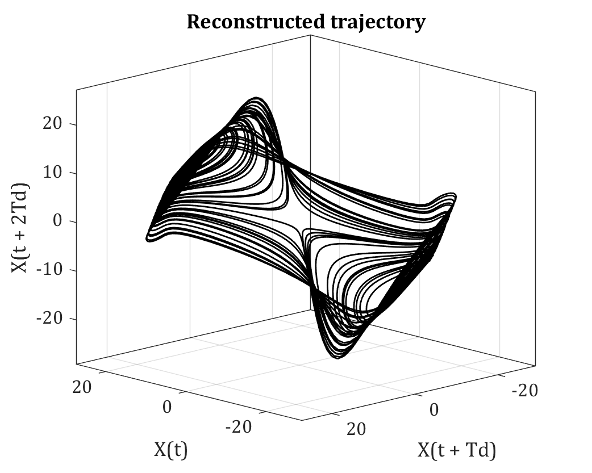

# Max Lyapunov Exponent (for Biomechanics)

**Summary:**

The code computes max Lyapunov exponent approach using the algorithm suggested by Rosenstein, 1993 with the modification suggested by Beaudette, 2016 to two different examples:

1. Calculating max Lyapunov exponent for recorded kinematic data of a repetitive handling task.
2. Lorenz system.

To see the validation, run "example.mlx". We employed this code to calculate spinal stability during repetitive lifting tasks.

**Refs:**

1. Beaudette, Shawn M., et al. "On the use of a Euclidean norm function for the estimation of local dynamic stability from 3D kinematics using time-delayed Lyapunov analyses." _Medical engineering & physics_ 38.10 (2016): 1139-1145.
2. Eskandari, Amir H, et al. "Comparative Evaluation of Different Spinal Stability Metrics." Available at SSRN 4455773.
3. Rosenstein, Michael T., James J. Collins, and Carlo J. De Luca. "A practical method for calculating largest Lyapunov exponents from small data sets." _Physica D: Nonlinear Phenomena_ 65.1-2 (1993): 117-134.

**Prerequisits:**

1. Statistics and Machine Learning Toolbox (_ **pdist** _ function)

## Repetitive lifting task

Trunk rotation was extracted from the T8 segment. As the number of data samples per cycle can influence the estimate of stability, the data were resampled to obtain a mean value of 300 data samples per movement cycle (50 samples per second) while preserving the cycle-to-cycle variability in movement. The Euclidean norm transformation function was used to combine the rotation into a single time-series. Prior to normalization, T8 rotations were independently shifted to avoid the incidence of zero-crossings (Beaudette et al., 2016). In order to reconstruct the state-space of the normalized signal, a constant time delay of 30 samples (10% of the length of the average cycle) with embedding dimension of 5 was used for all trials (Granata and England, 2006).

 **Ref:** Granata, Kevin P., and Scott A. England. "Stability of dynamic trunk movement." Spine 31.10 (2006)

### Normalizing the signal

Based on Beaudette, 2016, to develop a standard for the analysis of 3D dynamic kinematic waveforms, all dimensions of a 3D signal should be shifted independently to avoid the incidence of zero-crossings prior to the calculation of Euclidean norm and subsequent estimation of local dynamic stability.

### Calculating Lyapunov exponent

Short-term and long-term LyE (LyE-S, LyE-L) were identified by fitting a line through the average logarithmic divergence plot spanning over 0–0.5 and 4–10 cycles, respectively (Eskandari et al., 2023). Larger exponents indicate greater sensitivity to local perturbations, with negative and positive signs corresponding to local stability and local instability, respectively.

### Reconstructed trajectory

## Divergence curve

## Lorenz system
The following Lorenz differential equations were solved numerically using a fourth-order Runge-Kutta integration with a step size equal to 0.01. The initial point was chosen near the attractor and the transient points (5 seconds) were discarded.
dx/dt = s(y-x)
dy/dt = x(R-z) - y
dz/dt = xy - bz
The following figure shows the attractor by choosing s = 16.0, R = 45.92, b = 4.0.

### Calculating max Lyapunov exponent based on a single state

The x-coordinate time series was used to reconstruct the dynamics.

## Reconstructed trajectory

## Divergence curve

